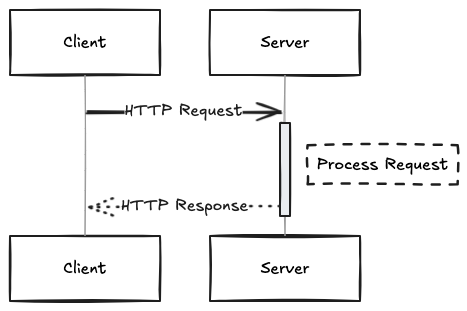

# Software Development Bootcamp

## Unit 2: JavaScript Foundations

### Lesson 7: APIs and JSON

### Gurneesh Singh

---

# Agenda

<div style="font-size: 20px;">

- Recap of Previous Lesson (Asynchronous JavaScript)
- Section 1: Dynamic Data & APIs
- Section 2: Remote API Hands-On (Postman)
- Section 3: JSON (JavaScript Object Notation)
- Section 4: Exercise

</div>

---

# Learning Objectives

By the end of this class, you will be able to:

*   Use APIs to leverage dynamic data in websites
*   Handle data in JSON format


---

# Recap: Asynchronous JavaScript

<div style="font-size: 18px;">

- **Synchronous vs. Asynchronous**: Sync code blocks, Async code doesn't wait.
- **Call Stack**: Tracks function execution.
- **Web APIs**: Browser features (like `setTimeout`, `fetch`) that handle async tasks.
- **Callback Queue**: Holds completed async tasks' callbacks.
- **Event Loop**: Moves callbacks from the queue to the stack when the stack is empty.
- **Callbacks**: Functions passed to run after an async operation.
- **Promises**: Objects representing the eventual result of an async operation (pending, fulfilled, rejected).
- **Async/Await**: Syntactic sugar for Promises, making async code look synchronous.

*Key takeaway: Async patterns help manage operations that take time (like network requests) without blocking the main thread.*

</div>

---

# Section 1: Dynamic Data & APIs

## What is Dynamic Data?

<div style="font-size: 20px;">

- Data that changes over time, often fetched from external sources.
- Examples: Weather forecasts, stock prices, social media feeds, search results.
- Websites need ways to request and receive this data *after* the initial page load.
- Problem: How do different systems, potentially built with different technologies, talk to each other?

</div>

---

## How Computers Communicate: The Web

<div style="display: grid; grid-template-columns: 1fr 1fr; gap: 20px; align-items: center;">

  <!-- Column 1: Text -->
  <div style="font-size: 20px;">

- **Client-Server Model**: Your browser (client) requests resources (HTML, CSS, JS, data) from a web server. <br/><br/>
- **HTTP (HyperText Transfer Protocol)**: The language clients and servers use to communicate. <br/>
    - **Request**: Client asks for something (e.g., "GET me the weather for Toronto"). <br/>
    - **Response**: Server sends back the resource or an error message.

  </div>

  <!-- Column 2: Image -->
  <div>
---



  </div>

</div>

---

## REST (Representational State Transfer)

[Rest](./Rest.md)

---

## What is an API?

<div style="font-size: 20px;">

**API (Application Programming Interface)**

[Api](./api.md)
---

# Section 2: Remote API Hands-On

<div style="font-size: 20px;">

**Objectives:**
*   Make an API request using a tool.
*   Recognize a JSON file structure.

**Key Tools/Resources:**
*   **Postman**: A popular tool for testing APIs. (Alternative: ThunderClient)
*   Simple APIs: [Official Joke API](https://github.com/15Dkatz/official_joke_api), [The Cat API](https://thecatapi.com/), [List of Beginner APIs](https://github.com/public-apis/public-apis)

</div>

---

## Making API Requests with ThunderClient

<div style="font-size: 20px;">

1.  **Open ThunderClient**: Create a new request tab.
2.  **Select HTTP Method**: Choose `GET`.
3.  **Enter Request URL**: Use `https://official-joke-api.appspot.com/random_joke`
4.  **Send Request**: Click the "Send" button.
5.  **Inspect Response**:
    *   **Status Code**: Look for `200 OK`.
    *   **Body**: Observe the data returned. What format is it in?
    *   **Headers**: Examine metadata about the response.


</div>

---

## Exploring Different APIs / Endpoints

<div style="font-size: 20px;">

- **Try another GET request**:
    - `https://official-joke-api.appspot.com/jokes/ten` (Gets 10 jokes)
    - `https://catfact.ninja/fact` (Gets a random cat fact)
- **APIs with Parameters**: Some APIs let you customize the request.
    
</div>

---

# 10-minute Break

---

# Section 3: JSON


<div style="font-size: 20px;">

**Objectives:**
*   Recognize JSON syntax and structure.
*   Understand how to parse JSON in JavaScript.

**Key Resource:**
*   [JSON.org](https://www.json.org/json-en.html)
*   JSON Cheat Sheet (LMS)

</div>

---

## What is JSON?

<div style="font-size: 18px;">

**JSON (JavaScript Object Notation)**

- A lightweight data-interchange format.
- Easy for humans to read and write.
- Easy for machines to parse and generate.
- **Text-based**: It's just a string!
- **Language-Independent**: Though derived from JavaScript, it's used by almost all programming languages.
- The *de facto* standard for sending data between web servers and web browsers/applications via APIs.

**Important**: JSON is **NOT** JavaScript, although its syntax is a subset of JavaScript object literal syntax.

</div>

```json
{
  "name": "John",
  "age": 30,
  "city": "New York",
  "hobbies": ["reading", "traveling", "cooking"]
}
```


---

## JSON Syntax Rules

<div style="font-size: 18px;">

- Data is in **name/value pairs** (like JS object properties).
    - `"name": "value"`
- Data is separated by **commas**.
- **Curly braces `{}` hold objects**.
    - An unordered collection of name/value pairs.
- **Square brackets `[]` hold arrays**.
    - An ordered list of values.
- **Keys (names)** MUST be **strings** in double quotes (`"`).
- **Values** can be:
    - A string (in double quotes)
    - A number
    - An object (JSON object)
    - An array
    - A boolean (`true` or `false`)
    - `null`

**No functions, no comments, no undefined, no trailing commas!**

</div>

---

## JSON Example

```json
{
  "id": 73,
  "type": "programming",
  "setup": "Have you heard about the new Cray supercomputer? It's so fast...",
  "punchline": "It completes an infinite loop in 6 seconds.",
  "isFunny": true,
  "tags": ["tech", "programming", "computers"],
  "relatedJokes": [
    { "id": 42, "setup": "Why do programmers prefer dark mode?" },
    { "id": 101, "setup": "What's the object-oriented way to become wealthy?" }
  ],
  "source": null
}
```

*(Compare this to the response from the Joke API in Thunderclient)*

---

## Parsing JSON in JavaScript

<div style="font-size: 18px;">

When you receive JSON data (e.g., from an API), it typically arrives as a **string**. You need to convert it into a JavaScript object or array to work with it.

- **`JSON.parse(jsonString)`**: Converts a JSON string into a JavaScript value (object, array, string, number, boolean, null).

```javascript
const jsonString = '{"name": "Alice", "age": 30, "isStudent": false}';
const jsObject = JSON.parse(jsonString);

console.log(jsObject.name); // Output: Alice
console.log(jsObject.age);  // Output: 30
```

- **`JSON.stringify(jsValue)`**: Converts a JavaScript value into a JSON string. (Useful for sending data *to* an API).

---

```javascript
const dataToSend = { 
  product: "Laptop", 
  quantity: 1, 
  features: ["16GB RAM", "512GB SSD"] 
};
const jsonPayload = JSON.stringify(dataToSend);

console.log(jsonPayload); 
// Output: {"product":"Laptop","quantity":1,"features":["16GB RAM","512GB SSD"]}
```

</div>

---

## Introduction to `fetch`

<div style="font-size: 18px;">

- How do we get data *asynchronously* from sources like local files or network requests directly from our JavaScript code in the browser?
- The **`fetch` API** is the modern, standard way to do this.
- It's built into modern browsers (a Web API).
- It uses **Promises** to handle the asynchronous nature of data fetching.

```javascript
// Basic request for a local JSON file
fetch('./data/joke.json') // Path relative to the HTML file
  .then(response => {
    // Handle the response
  })
  .catch(error => {
    // Handle any errors during the fetch
  });
```


</div>

---

## Handling the `fetch` Response

<div style="font-size: 18px;">

- The first `.then()` receives a `Response` object.
- This object contains information about the response (like status code, headers), but **not the actual data** yet.
- To get the data, you need to call a method on the `Response` object based on the expected data format. For JSON, use **`.json()`**.
- The `.json()` method also returns a **Promise**, so we need another `.then()`!

```javascript
fetch('./data/joke.json') // Fetching the local file
  .then(response => {
    // Check if the request was successful (status code 200-299)
    // For local files, `response.ok` is usually true if the file exists
    if (!response.ok) {
      throw new Error(`HTTP error! status: ${response.status}`); // Might indicate file not found or other issues
    }
    return response.json(); // Parse the response body as JSON
  })
  .then(data => {
    // 'data' is now the actual JavaScript object/array from the JSON file
    console.log(data); 
    // Example structure depends on your joke.json file
    // e.g., { id: ..., type: ..., setup: ..., punchline: ... } 
  })
  .catch(error => {
    console.error('Fetch error:', error);
  });
```

</div>

---

## Updating the Webpage (DOM Manipulation)

<div style="font-size: 12px;">

- Once you have the data from your local file (after parsing the JSON), you can use standard **DOM manipulation** techniques to display it on your HTML page.

1.  **Get a reference** to the HTML element(s) where you want to display the data (e.g., using `document.getElementById`, `document.querySelector`).
2.  **Update the content** of those elements (e.g., using `.textContent`, `.innerHTML`).

```html
<!-- In your HTML -->
<div id="joke-container">
  <p id="setup"></p>
  <p id="punchline"></p>
</div>
<button id="get-joke-btn">Get Joke from File</button> 


```

---

```javascript
// In your JavaScript (inside the second .then block or a function)
const setupElement = document.getElementById('setup');
const punchlineElement = document.getElementById('punchline');
const getJokeBtn = document.getElementById('get-joke-btn');
function fetchJokeFromFile() {
  fetch('./data/joke.json') // Fetch the local file
    .then(response => {
      if (!response.ok) {
        throw new Error(`Failed to fetch joke.json: ${response.statusText}`);
      }
      return response.json();
    })
    .then(data => {
      console.log(data); // The parsed JSON data from the file
      // Assuming joke.json has setup and punchline properties
      setupElement.textContent = data.setup; 
      punchlineElement.textContent = data.punchline; 
    })
    .catch(error => {
      console.error('Fetch error:', error);
      setupElement.textContent = 'Could not load joke.';
      punchlineElement.textContent = '';
    });
}
// Add event listener to the button
getJokeBtn.addEventListener('click', fetchJokeFromFile);
```
</div>
